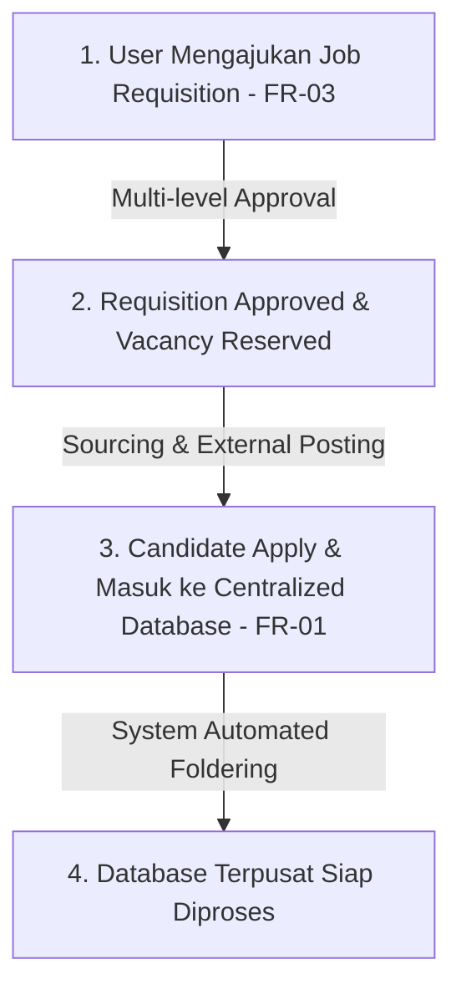

# Master Dokumentasi Teknis: ATS Jaknot (Enterprise Edition)
**Versi:** 1.0
**Disusun oleh:** Nabil (HRIS & Product Development Intern)
**Stakeholder Utama:** Kak Nadira (PIC), Divisi HRGA, & Manajemen Jaknot
**Konteks Dokumen:** Dokumen ini merangkum seluruh perencanaan pra-pengembangan sistem *Applicant Tracking System* (ATS) Jaknot, yang menghubungkan perencanaan tenaga kerja (*Workforce Planning/MPP*) hingga proses *hiring*, dengan fokus pengerjaan 2 minggu ke depan pada modul **FR-01** dan **FR-03**, sementara modul pendukung lainnya dirancang sebagai *master plan* jangka panjang.

---

## Daftar Isi
1. [Product Requirements Document (PRD)](#1-product-requirements-document-prd)
2. [Software Requirements Specification (SRS)](#2-software-requirements-specification-srs)
3. [System Design Document (SDD)](#3-system-design-document-sdd)
4. [UI/UX Flow & Design System (Gaya Workday)](#4-uiux-flow--design-system-gaya-workday)
5. [Task Breakdown (Sprint 1 Active Scope & Roadmap)](#5-task-breakdown-fokus-2-minggu--sprint-1)

---

## 1. Product Requirements Document (PRD)

### 1.1 Latar Belakang & Masalah
Proses rekrutmen konvensional di Jaknot saat ini masih menghadapi beberapa kendala operasional nyata yang ditemukan dari hasil *discovery* 7 divisi HR:
* **Fragmentasi Data:** Database pelamar dan pelacakan status (*tracking*) masih terpencar di file spreadsheet masing-masing rekruter, menyulitkan rekapitulasi tahunan dan proses *backup* antar staf.
* **Kontrol Headcount Lemah:** Pengajuan rekrutmen terkadang berjalan tanpa acuan Manpower Planning (MPP) formal yang baku, memicu celah kontrol anggaran perusahaan.
* **Kendala Lapangan (*Pain Points*):** Tingginya angka *candidate ghosting*, ketidakhadiran wawancara (*absenteeism*) pada posisi *Daily Worker* (DW), serta keterbatasan alat komunikasi karena pesan manual WhatsApp sering terkena pembatasan (*limit*).
* **Subjektivitas & Keterlambatan:** Penilaian *interview* belum terstandarisasi dengan *scorecard* baku, serta waktu tunggu respons (*feedback*) dari *user* yang sering melambat.

### 1.2 Tujuan Produk
* **Tujuan Utama:** Menyediakan platform ATS enterprise tunggal yang terpusat, transparan, dan *data-driven* untuk merencanakan tenaga kerja, mengontrol lowongan, dan mempercepat *time-to-hire*.
* **Cakupan Aktif 2 Minggu (Sprint 1):** Berfokus penuh pada **FR-01 (Centralized Candidate Database & Automated Foldering)** dan **FR-03 (Job Requisition & Approval Workflow)**. Modul lainnya masuk ke dalam kerangka enterprise jangka panjang.
* **Non-Goals (Di luar scope MVP):** Tidak menangani payroll, manajemen absensi, *performance management*, maupun keputusan *hiring* otomatis penuh berbasis AI tanpa *human review*.

### 1.3 Target Pengguna (User Personas)
* **Admin HR / Recruiter:** Mengelola *requisition*, memusatkan *database* pelamar, melakukan *tracking*, dan integrasi pesan via *Watzap API*.
* **Hiring Manager / User (Department Head):** Mengajukan permintaan lowongan, meninjau profil kandidat, dan memberikan *feedback*.
* **Management / Approver (CEO / GM Warehouse / HR Manager):** Memberikan persetujuan berjenjang (*approval matrix*) pada Manpower Plan (MPP) dan pengajuan lowongan.
* **Kandidat (Pelamar):** Mengisi form data diri dan melamar pekerjaan.

### 1.4 Cakupan Fitur Utama (Sprint 1 Focus & Roadmap)
* **FR-01 (Fokus Aktif): Centralized Candidate Database & Automated Foldering** — Bank data terpusat pelamar dengan pembuatan *folder* virtual secara otomatis.
* **FR-02:** Workforce Planning & Vacancy Reconciliation.
* **FR-03 (Fokus Aktif): Job Requisition & Approval Workflow** — Pembuatan permintaan lowongan resmi dengan alur persetujuan berjenjang.
* **FR-04 hingga FR-19:** Sourcing, Candidate Application, Pipeline, Screening, Scorecard, Scheduling, CV Sharing, Decision, Offer, Preboarding, SLA, Notifications, Dashboards, dan RBAC.

### 1.5 High-Level Flow (Alur Kerja Utama Sprint 1)


---

## 2. Software Requirements Specification (SRS)

### 2.1 Aktor & Hak Akses (Role-Based Access)
* **Admin HR:** Kelola master data, konfigurasi sistem, audit log, dan akses menyeluruh enterprise.
* **Recruiter:** Mengelola *requisition*, mengunggah kandidat ke *centralized database*, dan memantau *pipeline*.
* **Hiring Manager:** Mengajukan lowongan, menyetujui, dan mereview kandidat dalam *scope* divisinya.
* **Management / Approver:** Memberikan otorisasi persetujuan anggaran dan kuota headcount.

### 2.2 Functional Requirements (FR) Detail

* **FR-01 (Candidate Database & Foldering):**
  * FR-01.1: Sistem harus menampung data profil kandidat (nama, kontak, pengalaman, dokumen CV) ke dalam satu *database* terpusat.
  * FR-01.2: Sistem harus otomatis membuat struktur *folder* virtual berdasarkan posisi lowongan dan tahapan rekrutmen.
  * FR-01.3: Sistem harus mendeteksi potensi duplikasi data berdasarkan email atau nomor telepon.

* **FR-03 (Job Requisition & Approval):**
  * FR-03.1: *User* dapat membuat *requisition* dengan menyertakan parameter posisi, departemen, jumlah, *justification*, dan rentang gaji.
  * FR-03.2: Requisition wajib melalui alur persetujuan berjenjang (*sequential/parallel approval*) sebelum berstatus aktif.
  * FR-03.3: Requisition tidak dapat diajukan jika kuota *vacancy* pada MPP tidak mencukupi, kecuali mendapat *exception approval*.

### 2.3 Business Rules (Aturan Bisnis)
* **BR-01:** Setiap *Requisition* standar wajib terikat pada alokasi *vacancy* MPP yang sah dan aktif.
* **BR-02:** Data kandidat yang masuk ke *centralized database* tidak boleh dihapus secara fisik demi keperluan audit; menggunakan mekanisme *retention policy*.
* **BR-03:** Perubahan status pada alur persetujuan wajib mencatat *timestamp*, *actor*, dan alasan penolakan jika dikembalikan (*rejected/returned*).

### 2.4 Non-Functional Requirements (NFR)
* **Performa:** Waktu muat halaman dashboard (*P95 response*) maksimum 3 detik untuk transaksi standar.
* **Keamanan:** Menerapkan enkripsi data sensitif (PII) *at-rest* dan *in-transit* menggunakan HTTPS serta kontrol berbasis hak akses (*least privilege*).
* **Kompatibilitas:** Tampilan antarmuka responsif dan mendukung peramban enterprise terkini (Chrome, Edge).

---

## 3. System Design Document (SDD)

### 3.1 Arsitektur Sistem (High-Level)
Pola arsitektur yang digunakan adalah **Modular Monolith** (bukan *microservices*). Pendekatan ini sangat ideal untuk pengembangan tim skala internal/magang karena lebih mudah dikelola namun tetap terisolasi dengan baik per domain modul, sehingga di masa depan dapat dengan mudah dipecah menjadi layanan terpisah jika diperlukan.

```text
┌──────────────────────────────────────────────────────────────────┐
│                         CLIENT (Browser)                         │
│             Frontend Dashboard (Workday Inspired Theme)          │
│       HR Admin Dashboard | Requisition View | Candidate Intake   │
└───────────────────────────┬────────────────────────────────────-─┘
                             │ HTTPS (REST, JWT Bearer)
┌───────────────────────────▼───────────────────────────────────-──┐
│                        API GATEWAY LAYER                         │
│                     FastAPI / Node.js Backend                    │
│   Auth Middleware → Rate Limiting → Request Validation (Schema)  │
└───────────┬───────────────┬───────────────┬───────────────────-──┘
            │               │               │
   ┌────────▼──────┐ ┌──────▼───────┐ ┌─────▼────────────┐
   │  Core Service │ │ Document AI  │ │ Requisition &    │
   │  (Job, User,  │ │  Service     │ │ Approval Service │
   │   Candidate   │ │ (Automated   │ │ (Multi-level     │
   │    CRUD)      │ │  Foldering)  │ │   Workflow)      │
   └────────┬──────┘ └──────┬───────┘ └─────▼────────────┘
            │               │               │
            └───────┬───────┴───────┬───────┘
                     │               │
            ┌────────▼──────┐ ┌──────▼───────────┐
            │ PostgreSQL    │ │  Object Storage  │
            │ (Data Utama)  │ │  (CV & Sertifikat)│
            └───────────────┘ └──────────────────┘
```

#### Alasan Desain:
* **Pemisahan Logika Domain:** Modul pengajuan lowongan (FR-03) dipisahkan secara tegas dari modul bank data kandidat (FR-01) untuk menjaga integritas transaksi database.
* **Object Storage Terpisah dari DB:** Berkas dokumen pelamar (CV/sertifikat) tidak disimpan sebagai biner mentah (*BLOB*) di dalam tabel PostgreSQL agar performa kueri tetap optimal, melainkan cukup menyimpan *path* atau referensi URL objeknya di dalam database.

### 3.2 Tech Stack

| Layer | Teknologi Utama | Alasan Pemilihan |
| --- | --- | --- |
| **Frontend** | React / Next.js, TypeScript, TailwindCSS | Cepat untuk membangun antarmuka dashboard korporat yang kompleks dengan konsistensi desain yang tinggi. |
| **Backend API** | FastAPI (Python) atau Express.js | Performa tinggi, asinkron, serta memiliki validasi skema data yang ketat dan otomatis. |
| **Database** | PostgreSQL | Sistem basis data relasional yang sangat kuat untuk menangani relasi antar data *Workforce Planning*, *Requisition*, dan *Candidate*. |
| **Object Storage** | Supabase Storage / Cloud Storage | Menyimpan file dokumen CV dan sertifikat secara aman dan terpisah dari tabel transaksional database. |
| **Auth & Security** | JWT (JSON Web Token) + Bcrypt | Standar autentikasi *stateless* yang aman untuk mengelola hak akses berdasarkan *Role-Based Access Control (RBAC)*. |

### 3.3 Skema Database (Entity-Relationship Core untuk Sprint 1)

* **Tabel `users` (Pengguna Sistem):**
  * `id` (UUID, PK), `name`, `email` (unique), `password_hash`, `role` (Admin, Recruiter, Hiring Manager, Approver), `created_at`.

* **Tabel `job_requisitions` (Modul FR-03 - Lowongan Kerja):**
  * `id` (UUID, PK), `position_title`, `department_id`, `quantity`, `justification`, `budget_range`, `status` (Draft, Pending Approval, Approved, Rejected, Closed), `created_by` (FK -> users.id), `created_at`.

* **Tabel `candidates` (Modul FR-01 - Master Data Kandidat):**
  * `id` (UUID, PK), `full_name`, `email`, `phone`, `cv_file_url`, `folder_path` (struktur *automated foldering*), `applied_at`.

* **Tabel `applications` (Relasi Kandidat ke Lowongan):**
  * `id` (UUID, PK), `candidate_id` (FK -> candidates.id), `requisition_id` (FK -> job_postings.id), `current_stage`, `status` (Active, Hired, Rejected).

#### Relasi Antar Tabel:
```text
users (1) ───────────< (N) job_requisitions
job_requisitions (1) ─< (N) applications
candidates (1) ───────< (N) applications
```

### 3.4 API Design (REST - Fokus Sprint 1: FR-01 & FR-03)
*Base URL: `/api/v1`*

| Method | Endpoint | Deskripsi / Fungsi Utama |
| --- | --- | --- |
| `POST` | `/requisitions` | Membuat draf dan mengajukan *Job Requisition* baru (FR-03). |
| `GET` | `/requisitions` | Menampilkan daftar lowongan beserta status persetujuannya. |
| `PATCH` | `/requisitions/{id}/approve` | Menyetujui atau menolak permintaan lowongan oleh *Approver/Management*. |
| `POST` | `/candidates/intake` | Mengunggah data kandidat baru ke *Centralized Database* & memicu *automated foldering* (FR-01). |
| `GET` | `/candidates/search` | Melakukan pencarian dan filter data kandidat di dalam bank data terpusat. |

### 3.5 Struktur Backend (Folder Structure)

```text
backend/
├── app/
│   ├── main.py                  # Entrypoint aplikasi backend
│   ├── core/
│   │   ├── config.py             # Konfigurasi environment variables
│   │   ├── security.py           # Hashing password & manajemen token JWT
│   │   └── dependencies.py       # Middleware auth & penjagaan role (RBAC)
│   ├── modules/
│   │   ├── auth/                 # Modul autentikasi & user management
│   │   ├── requisitions/         # Modul FR-03 (Job Requisition & Approval)
│   │   └── candidates/           # Modul FR-01 (Centralized Database & Foldering)
│   └── db/
│       ├── base.py
│       ├── session.py
│       └── migrations/           # Skrip migrasi database
├── requirements.txt
└── .env.example
```

### 3.6 Keamanan & Privasi Data
* **Enkripsi Data (PII):** Data pribadi sensitif pelamar (*Personally Identifiable Information* seperti nomor telepon dan alamat email) dilindungi dengan standar keamanan tinggi dan pembatasan akses (*need-to-know basis*).
* **Manajemen Berkas Dokumen:** Berkas CV dan sertifikat disimpan di dalam direktori atau *bucket storage* privat, di mana akses unduhnya dikendalikan melalui tautan berbatas waktu (*signed URL*), bukan tautan publik terbuka.
* **Role-Based Access Control (RBAC):** Validasi hak akses dilakukan di sisi server (*server-side validation*) pada setiap endpoint API untuk memastikan *Hiring Manager*, *Recruiter*, dan *Management* hanya mengakses data sesuai dengan wewenang divisinya masing-masing.

---

## 4. UI/UX Flow & Design System (Gaya Workday)

### 4.1 Prinsip Desain & Palet Warna (Standar Workday Enterprise)
Mengadopsi estetika bersih, profesional, dan padat data ala software HR korporat global (*Workday*):
* **Primary Navy Blue (`#1B365D`):** Digunakan untuk sidebar navigasi utama dan header instans.
* **Accent Orange (`#FF6B35`):** Digunakan khusus untuk tombol aksi utama (*Primary CTA* seperti "Create Requisition").
* **Blue Cloud (`#E8F1F5`) & White (`#FFFFFF`):** Digunakan sebagai latar belakang area kerja (*canvas*) dan kartu kontainer (*card-based layout*) dengan sudut tumpul yang rapi.

### 4.2 Alur Layar Utama (Screen Flow)
* **Halaman Dashboard Utama:** Menampilkan ringkasan kartu metrik (*Open Requisitions, Total Candidates*). Modul Sprint 1 (FR-01 & FR-03) aktif dan dapat diakses, sementara modul masa depan diberi status *locked/greyed out*.
* **Halaman Job Requisition (FR-03):** Tabel daftar lowongan kerja dengan filter status persetujuan, tombol *"Create Requisition"* beraksen oranye, dan modal formulir pengajuan bertingkat.
* **Halaman Candidate Database (FR-01):** Tabel data pelamar bergaya korporat Workday, lengkap dengan kolom nama, tipe pelamar, tanggal melamar, dan navigasi folder otomatis.

---

## 5. Task Breakdown (Fokus 2 Minggu / Sprint 1)

Untuk memastikan pengerjaan terstruktur, rapi, dan tidak berantakan (*chaotic*), berikut rincian pembagian tugas untuk 2 minggu ke depan dengan fokus pada **FR-01** dan **FR-03**:

| Fase / Hari | Task / Pekerjaan Aktif | Output / Hasil |
| --- | --- | --- |
| **Hari 1–3** | Setup struktur database inti (`job_requisitions`, `candidates`, `applications`) dan konfigurasi endpoint backend awal. | Skema DB siap & koneksi API dasar berjalan. |
| **Hari 4–7** | Pengembangan **FR-03**: Pembuatan form *Job Requisition*, logika alur *multi-level approval*, dan pembaruan status *vacancy*. | Modul pengajuan & persetujuan lowongan berfungsi. |
| **Hari 8–11** | Pengembangan **FR-01**: Modul *Candidate Master*, form intake file, integrasi *automated foldering*, dan deteksi duplikasi. | Bank data terpusat & foldering otomatis aktif. |
| **Hari 12–14** | Integrasi UI Staging dengan tema Workday (*Blue Navy, Orange, Blue Cloud*), penguncian modul masa depan, dan uji coba alur. | Dashboard staging Sprint 1 siap dipamerkan. |
